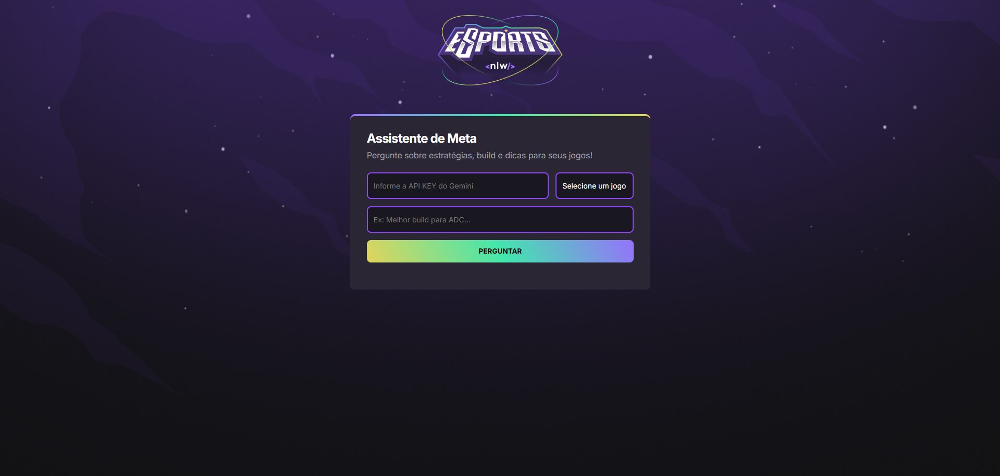
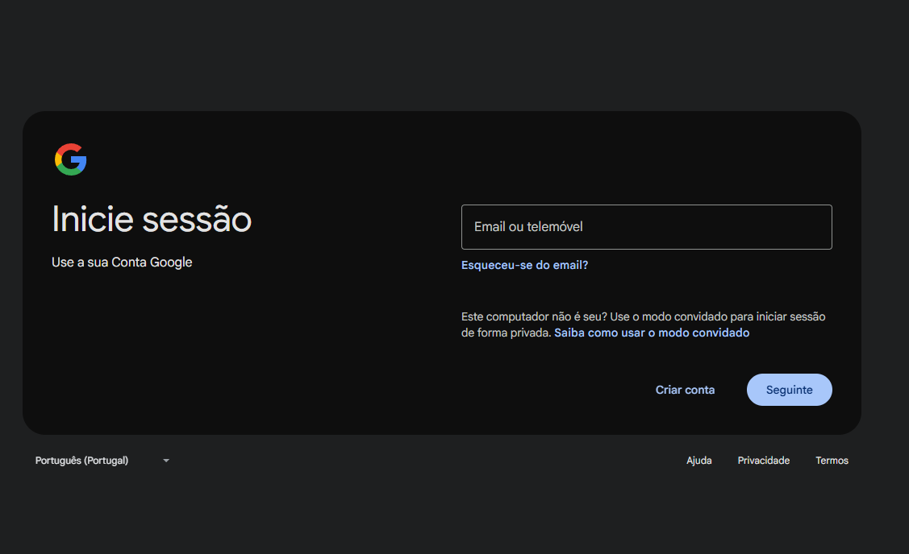
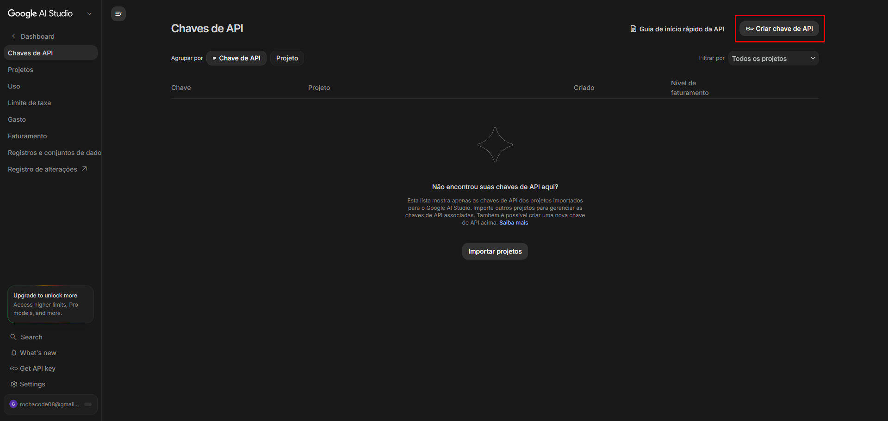
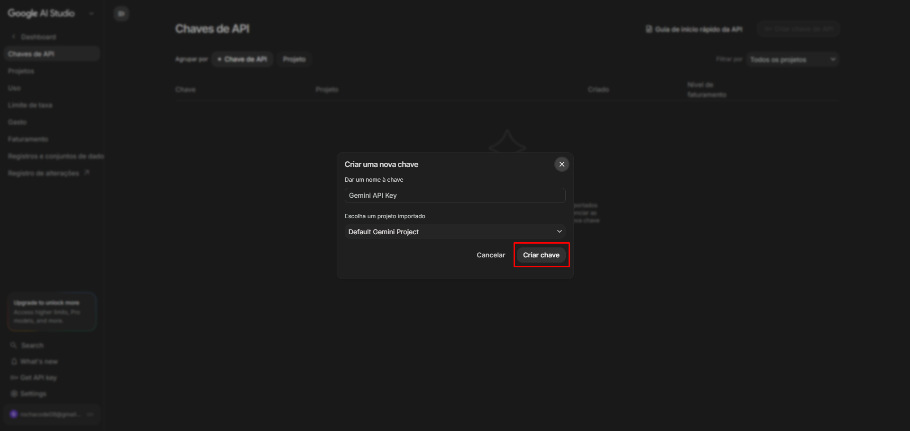
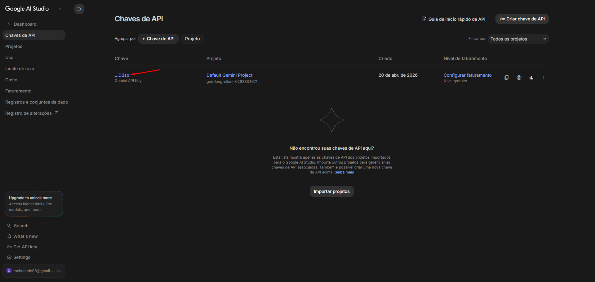
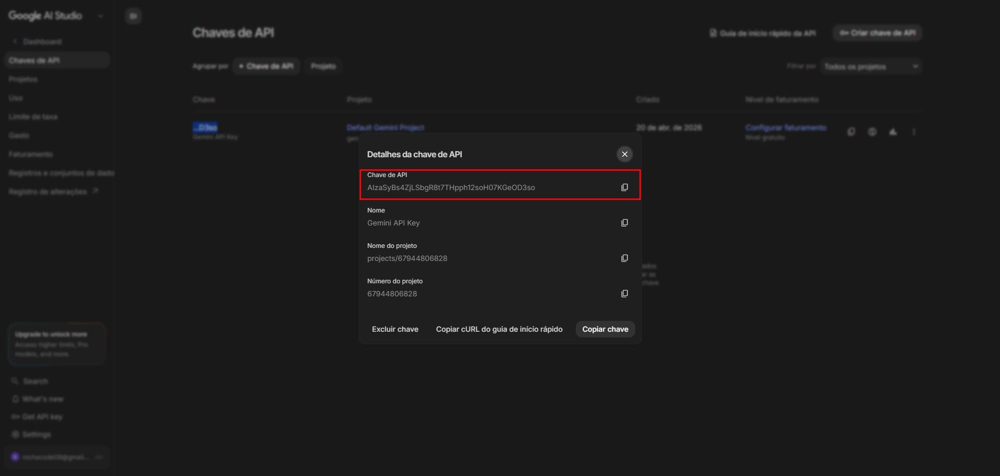

# 🧠 Assistente de Meta para Esports

Assistente de estratégias para jogos de **esports** que usa a **API do Google Gemini** para responder sobre **builds, dicas e meta atual** de _Valorant_, _League of Legends_, _CS:GO_ e _Fortnite_.

---

## 🖼 Preview da Interface



---

## 🚀 Como Executar o Projeto

1. Clone o repositório ou baixe os arquivos
2. Obtenha sua **API Key do Gemini** (instruções abaixo)
3. Abra o arquivo `index.html` no navegador
4. Cole a chave, escolha o jogo e pergunte

---

## 🔑 Como Obter sua API Key do Gemini

> 💡 **Não é preciso** criar projeto no Google Cloud manualmente. O Google AI Studio faz isso automaticamente pra você.

### 1. Acesse o Google AI Studio

Vá em [aistudio.google.com](https://aistudio.google.com/)

### 2. Faça login com sua conta Google



### 3. Vá em **Chaves de API** 

No menu lateral, clique em **Chaves de API**. Na tela que abrir, clique em **Criar chave de API** no canto superior direito.



### 4. Dê um nome para sua chave

Na janela que aparecer, dê um nome pra chave (ex: `Gemini API Key`) e mantenha o projeto sugerido (**Default Gemini Project**). Depois clique em **Criar chave**.



### 5. Sua chave foi criada!

A chave aparece na listagem com um nome curto (ex: `...D3so`). Clique nela para ver os detalhes.



### 6. Copie a chave completa

Na janela de detalhes, clique no ícone de copiar ao lado da **Chave de API** ou no botão **Copiar chave**. A chave começa com `AIza...`.



> ⚠️ **Trate sua API Key como uma senha.** Nunca exponha publicamente (GitHub, redes sociais, prints sem borrar). Se vazar, volte no AI Studio e exclua a chave imediatamente — depois gere uma nova.

---

## 🕹 Usando o Assistente

1. Cole sua **API Key** no primeiro campo
2. Selecione o jogo no menu
3. Digite sua pergunta (ex: _"Melhor build para ADC no patch atual"_)
4. Clique em **Perguntar**

---

## 📁 Estrutura de Arquivos

```
projeto-assistente-esports/
├── assets/
│   ├── md/                      # Imagens usadas neste README
│   │   ├── Agents-Project.png
│   │   ├── login-google.png
│   │   ├── Get-ApiKey.png
│   │   ├── create-key.png
│   │   ├── view-key.png
│   │   └── key.png
│   ├── bg.jpg                   # Imagem de fundo do site
│   └── logo.png                 # Logo do projeto
├── index.html                   # Estrutura da página
├── style.css                    # Estilos da interface
├── script.js                    # Lógica e chamada da API Gemini
└── README.md                    # Este arquivo
```

---

## 🧰 Recursos Utilizados

- [Google Gemini API](https://ai.google.dev/) — modelo de IA generativa
- [Showdown.js](https://github.com/showdownjs/showdown) — converte Markdown em HTML na tela
- [Google Fonts — Inter](https://fonts.google.com/specimen/Inter) — tipografia

---

## ⚠️ Observações

- Você precisa da **sua própria API Key** do Gemini (gratuita)
- As respostas são limitadas a **500 caracteres** (regra definida no prompt, dentro do `script.js`)
- O assistente considera a **data atual do sistema** para responder sobre o patch vigente
- A API Key é usada **apenas no navegador** e enviada direto para a Google — nenhum outro servidor é envolvido

---

## 👨‍💻 Autor

Desenvolvido com 💙 por **[Gabriel Rocha Lopes](https://github.com/rochacode08)**

<a href="mailto:gabrielrocha.devstack@gmail.com">
        
    </a>
    <a href="https://www.linkedin.com/in/gabriel-rocha-devstack">
        
    </a>
    <a href="https://www.instagram.com/gabriel_lopess15/">
        
    </a>

---
